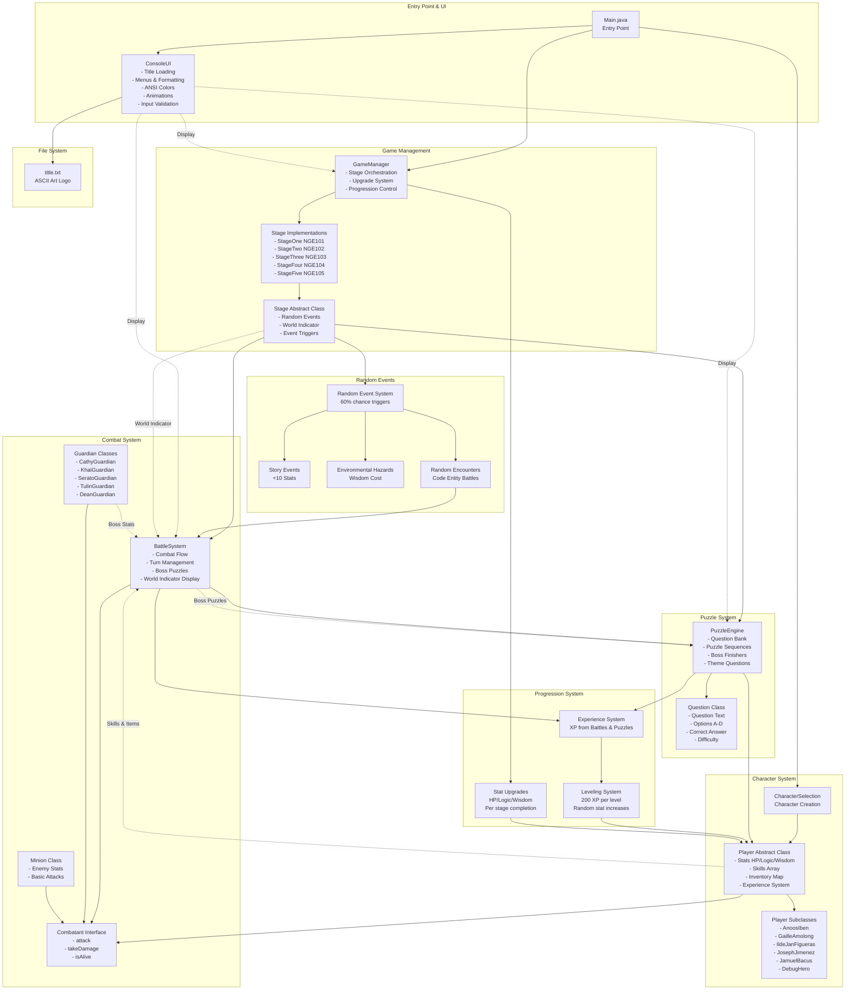
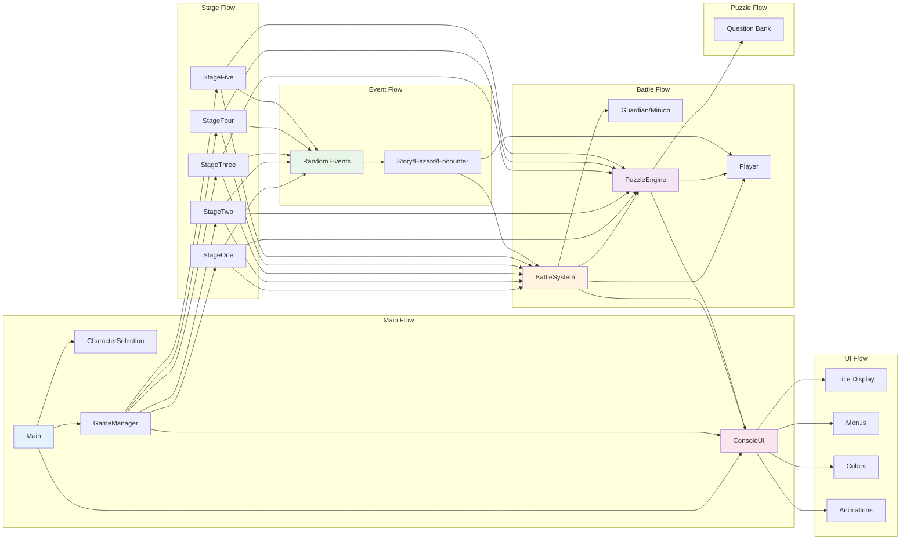

# The Lair - Complete Game Flowchart

## Master Flowchart: Complete Game Flow with All Components

This comprehensive Mermaid flowchart shows the entire game flow, including all components, storyline progression, system interactions, and how everything blends together.

```mermaid
flowchart TD
    Start([ GAME START]) --> LoadTitle[ ConsoleUI.getTitleFromFile<br/>Load ASCII Art from title.txt]
    LoadTitle --> TitleCheck{File Found?}
    TitleCheck -->|Yes| DisplayTitle[ Display ASCII Art Title Logo]
    TitleCheck -->|No| FallbackTitle[ Display Fallback Header]
    DisplayTitle --> MainMenu
    FallbackTitle --> MainMenu
    
    MainMenu[ Game Start Menu<br/>ConsoleUI.menu<br/>1. Watch full narration<br/>2. Skip narration]
    MainMenu --> MenuInput1{Get User Input<br/>with Validation}
    MenuInput1 -->|Invalid| MenuError1[ Invalid choice!<br/>Please enter 1 or 2.<br/>Retry Loop]
    MenuError1 --> MainMenu
    MenuInput1 -->|Valid 1| StoryNarration[ ConsoleUI.animateText<br/>Star Wars-style typewriter<br/>Display full story prologue]
    MenuInput1 -->|Valid 2| SkipNarration[ Narration skipped]
    StoryNarration --> CharacterSelection
    SkipNarration --> CharacterSelection
    
    CharacterSelection[ CharacterSelection.chooseCharacter<br/>Display 6 Character Options<br/>1. Iben Anoos - The Codebreaker<br/>2. Gaille Amolong - The Architect<br/>3. Ilde Jan Figueras - The Challenger<br/>4. Joseph Jimenez - The Balanced<br/>5. Jamuel Bacus - The Tactician<br/>6. DEBUG HERO - The Unbeatable]
    CharacterSelection --> CharInput{Get Character Choice<br/>Input Validation}
    CharInput -->|Invalid| CharError[ Invalid choice!<br/>Please enter 1-6<br/>Retry Loop]
    CharError --> CharacterSelection
    CharInput -->|Valid| CreatePlayer[ Create Player Object<br/>Initialize:<br/>- Stats HP/Logic/Wisdom<br/>- Skills Array<br/>- Inventory Map<br/>- Starter Items]
    CreatePlayer --> InitGameManager[ GameManager Initialization<br/>Create Stage List:<br/>StageOne, StageTwo, StageThree,<br/>StageFour, StageFive]
    
    InitGameManager --> StageLoop{ For Each Stage<br/>in Stages List}
    
    %% ============================================
    %% STAGE 1: NGE 101 - MA'AM CATHY
    %% ============================================
    StageLoop -->|Stage 1| Stage1[ STAGE 1: NGE 101<br/>The Hall of Ma'am Cathy]
    Stage1 --> Intro1[ StageOne.intro<br/>Display Guardian Intro:<br/>'NGE 101 – The Hall of Ma'am Cathy:<br/>This is very easy guys.<br/>Dali ra kaau ni ihuman ninyo.']
    Intro1 --> ExtractCode1[ Stage.getWorldIndicator<br/>Extract: 'NGE101'<br/>from stage name]
    ExtractCode1 --> InitBattle1[ BattleSystem Initialization<br/>BattleSystem player, scanner, 'NGE101']
    InitBattle1 --> MinionLoop1{ Minion Wave Loop<br/>5 Goblins<br/>HP: 40, ATK: 5}
    
    MinionLoop1 --> RandomEvent1{ Random Event?<br/>60% chance<br/>Stage.triggerRandomEvent}
    RandomEvent1 -->|20%| StoryEvent1[ Story Event<br/>Stage.triggerStoryEvent<br/>- Display story text<br/>- Gain +10 Logic or Wisdom<br/>- Animated text display]
    RandomEvent1 -->|20%| EnvHazard1[ Environmental Hazard<br/>Stage.triggerEnvironmentalHazard<br/>- Lose 10-30 Wisdom<br/>- 30% chance +5 Logic<br/>- If insufficient Wisdom: 50 HP damage]
    RandomEvent1 -->|20%| RandomEncounter1[ Random Encounter<br/>Stage.triggerRandomEncounter<br/>- Battle code entity<br/>- Syntax Error, Null Pointer, etc.<br/>- 15 XP reward]
    RandomEvent1 -->|40%| NoEvent1[ No Event<br/>Continue to battle]
    StoryEvent1 --> Battle1
    EnvHazard1 --> Battle1
    RandomEncounter1 --> Battle1
    NoEvent1 --> Battle1
    
    Battle1[ BattleSystem.startBattle<br/>Minion: Goblin #N<br/>World Indicator: NGE101]
    Battle1 --> BattleIntro1[ Display Battle Intro<br/>'A wild Goblin #N appears!']
    BattleIntro1 --> BattleLoop1{ While Player &<br/>Enemy Alive}
    
    BattleLoop1 --> PlayerTurn1[ PLAYER TURN]
    PlayerTurn1 --> DisplayWorld1[ Display World Indicator<br/>ConsoleUI.color 'NGE101'<br/>Bold Cyan ANSI]
    DisplayWorld1 --> ActionMenu1[ Action Menu<br/>ConsoleUI.menu<br/>1. Attack<br/>2. Signature Skill<br/>3. Defend<br/>4. Use Item<br/>5. Inspect Enemy]
    ActionMenu1 --> ActionInput1{Get Action Choice<br/>BattleSystem.safeNextInt<br/>Range: 1-5}
    ActionInput1 -->|Invalid| ActionError1[ Invalid choice!<br/>Please enter 1-5<br/>Retry with prompt inside try]
    ActionError1 --> ActionMenu1
    
    ActionInput1 -->|1 Attack| Attack1[ Player.attack<br/>Damage = Logic + random 0-30<br/>Apply to enemy]
    ActionInput1 -->|2 Skill| SkillMenu1[ Display Skills Table<br/>ConsoleUI.displaySkillsTable<br/>Show cooldowns, costs, status]
    SkillMenu1 --> SkillInput{Select Skill<br/>safeNextInt 1-N}
    SkillInput --> SkillCheck{Check:<br/>- Cooldown?<br/>- Wisdom Cost?<br/>- Skill Available?}
    SkillCheck -->|On Cooldown| CooldownMsg[ Skill on cooldown<br/>Display turns remaining]
    SkillCheck -->|Insufficient Wisdom| NoWisdom[ Not enough Wisdom<br/>Display required amount]
    SkillCheck -->|Valid| ExecuteSkill[ Execute Skill<br/>- Apply effects<br/>- Set cooldown<br/>- Use Wisdom<br/>- Deal damage/buffs]
    ActionInput1 -->|3 Defend| Defend1[ Set Defend Flag<br/>Player.setIsDefending true<br/>50% damage reduction next turn]
    ActionInput1 -->|4 Item| ItemMenu1[ Display Inventory<br/>ConsoleUI.displayItemsTable<br/>Show items and quantities]
    ItemMenu1 --> ItemInput{Select Item<br/>safeNextInt 1-N}
    ItemInput --> UseItem[ Use Item<br/>- POTION_SMALL: +100 HP<br/>- POTION_MED: +250 HP<br/>- ETHER_SMALL: +80 Wisdom<br/>- REVIVE: +50% HP<br/>- BOMB: 150 damage]
    ActionInput1 -->|5 Inspect| Inspect1[ Display Enemy Stats<br/>HP, Logic, Wisdom]
    
    Attack1 --> EnemyTurn1
    ExecuteSkill --> SkillEffects[Apply Skill Effects:<br/>- Debugger's Eye: enemyDefenseDown<br/>- Syntax Slayer: ×2 if debuffed<br/>- Blueprint Mind: logicBuff<br/>- Status effects applied]
    SkillEffects --> EnemyTurn1
    CooldownMsg --> EnemyTurn1
    NoWisdom --> EnemyTurn1
    Defend1 --> EnemyTurn1
    UseItem --> EnemyTurn1
    Inspect1 --> EnemyTurn1
    
    EnemyTurn1[ ENEMY TURN]
    EnemyTurn1 --> CheckMinionPuzzle{Minion?<br/>30% chance}
    CheckMinionPuzzle -->|Yes| MinionPuzzle1[ PuzzleEngine.triggerThemeQuestion<br/>Display theme question<br/>Answer A/B/C/D]
    MinionPuzzle1 --> MinionAnswer{Get Answer<br/>Input Validation}
    MinionAnswer -->|Invalid| MinionAnswerError[ Invalid input!<br/>Please enter A/B/C/D]
    MinionAnswerError --> MinionPuzzle1
    MinionAnswer -->|Correct| MinionReward[ Gain Random Item<br/>POTION_SMALL, ETHER_SMALL, or BOMB]
    MinionAnswer -->|Wrong| NoMinionReward[ Incorrect. No reward.]
    CheckMinionPuzzle -->|No| EnemyAttack1
    MinionReward --> EnemyAttack1
    NoMinionReward --> EnemyAttack1
    
    EnemyAttack1[ Enemy Attacks<br/>Enemy.attack<br/>Damage = Enemy Logic + variation]
    EnemyAttack1 --> CheckDefend1{Player Defending?<br/>Player.getIsDefending}
    CheckDefend1 -->|Yes| ReduceDamage1[ Reduce Damage 50%<br/>Set Defend Flag False]
    CheckDefend1 -->|No| FullDamage1[ Full Damage]
    ReduceDamage1 --> CheckPerfectDefense{Perfect Defense?<br/>Player.hasStatusEffect}
    FullDamage1 --> CheckPerfectDefense
    CheckPerfectDefense -->|Yes| BlockAll1[ Block All Damage<br/>Debug Hero ability]
    CheckPerfectDefense -->|No| ApplyDamage1[ Player.takeDamage<br/>Reduce HP]
    BlockAll1 --> TickRound1
    ApplyDamage1 --> TickRound1
    
    TickRound1[ End of Round]
    TickRound1 --> TickCooldowns1[ Player.tickCooldowns<br/>Decrement all cooldowns]
    TickCooldowns1 --> TickStatusPlayer1[ Player.tickStatusEffects<br/>Decrement status durations]
    TickStatusPlayer1 --> TickStatusEnemy1{Enemy is Guardian?}
    TickStatusEnemy1 -->|Yes| TickStatusGuardian1[ Guardian.tickStatusEffects<br/>Decrement debuff durations]
    TickStatusEnemy1 -->|No| DisplayHUD1
    TickStatusGuardian1 --> DisplayHUD1
    
    DisplayHUD1[ ConsoleUI.battleHUD<br/>Display:<br/>Player HP/Wisdom Green/Blue<br/>Enemy HP Red<br/>Colored ANSI display]
    DisplayHUD1 --> CheckVictory1{Enemy Defeated?<br/>Enemy.getCurrentHP <= 0}
    CheckVictory1 -->|Yes| Victory1[ Victory!<br/>Player.gainExperience 15 XP<br/>Check Level Up]
    CheckVictory1 -->|No| CheckDefeat1{Player Defeated?<br/>!Player.isAlive}
    CheckDefeat1 -->|Yes| GameOver1[ Game Over<br/>Return to Main]
    CheckDefeat1 -->|No| BattleLoop1
    
    Victory1 --> LevelCheck1{Level Up?<br/>Experience >= Required}
    LevelCheck1 -->|Yes| LevelUp1[ Player.levelUp<br/>- Level++<br/>- +35-65 HP random<br/>- +35-60 Logic random<br/>- +25-100 Wisdom random<br/>- Restore HP<br/>- Update experienceToNextLevel]
    LevelCheck1 -->|No| MinionLoop1
    LevelUp1 --> MinionLoop1
    
    MinionLoop1 -->|All 5 Minions Defeated| PuzzleSeq1
    MinionLoop1 -->|Player Defeated| GameOver1
    
    PuzzleSeq1[ PUZZLE SEQUENCE<br/>Before Boss Battle]
    PuzzleSeq1 --> RandomEvent2{ Random Event?<br/>60% chance}
    RandomEvent2 -->|Yes| Event2[Random Event<br/>Story/Hazard/Encounter]
    RandomEvent2 -->|No| PuzzleInit1[PuzzleEngine.runPuzzleSequence<br/>Guardian: 'Ma'am Cathy'<br/>Generate 3-5 puzzles]
    Event2 --> PuzzleInit1
    
    PuzzleInit1 --> PuzzleLoop1{ For Each Puzzle<br/>3-5 puzzles}
    PuzzleLoop1 --> SelectQuestion1[ Select Random Question<br/>from Guardian Bank<br/>Topic: Loops & Conditionals<br/>Difficulty: 1]
    SelectQuestion1 --> DisplayQuestion1[ Display Question<br/>ConsoleUI formatting<br/>4 Options: A, B, C, D]
    DisplayQuestion1 --> GetAnswer1{Get Answer<br/>Scanner.nextLine<br/>Validate A/B/C/D}
    GetAnswer1 -->|Invalid| AnswerError1[ Invalid input!<br/>Please enter A/B/C/D<br/>Retry same puzzle]
    AnswerError1 --> DisplayQuestion1
    GetAnswer1 -->|Valid| CheckAnswer1{Correct?<br/>Question.isCorrect}
    CheckAnswer1 -->|Yes| Correct1[ Correct!<br/>Well done!<br/>Continue to next]
    CheckAnswer1 -->|No| Wrong1[ Incorrect<br/>Take Damage:<br/>difficulty × 10 = 10 HP<br/>Display correct answer]
    Wrong1 --> CheckAlive2{Player Alive?}
    CheckAlive2 -->|No| GameOver1
    CheckAlive2 -->|Yes| PuzzleLoop1
    Correct1 --> PuzzleLoop1
    
    PuzzleLoop1 -->|All Complete| PuzzleScore1{Perfect Score?<br/>All Correct}
    PuzzleScore1 -->|Yes| BonusXP1[ Perfect Score!<br/>+50 Bonus XP<br/>Player.gainExperience 50]
    PuzzleScore1 -->|No| BossBattle1
    BonusXP1 --> BossBattle1
    
    BossBattle1[ BOSS BATTLE<br/>Ma'am Cathy<br/>HP: 500, Logic: 100, Wisdom: 200]
    BossBattle1 --> RandomEvent3{ Random Event?<br/>60% chance}
    RandomEvent3 -->|Yes| Event3[Random Event]
    RandomEvent3 -->|No| BossBattleLoop1
    Event3 --> BossBattleLoop1
    
    BossBattleLoop1{ While Player &<br/>Boss Alive}
    BossBattleLoop1 --> PlayerTurnBoss1[ Player Turn<br/>Display NGE101]
    PlayerTurnBoss1 --> ActionMenuBoss1[Action Menu<br/>Same as minion battle]
    ActionMenuBoss1 --> ExecuteActionBoss1[Execute Action<br/>Attack/Skill/Defend/Item/Inspect]
    ExecuteActionBoss1 --> BossCheck1{Boss HP ≤ 40%?<br/>Puzzle Uses < 3?<br/>PuzzleEngine.shouldTriggerFinisher}
    
    BossCheck1 -->|Yes| BossPuzzle1[ Boss Finisher Puzzle!<br/>PuzzleEngine.triggerFinisher<br/>Display: 'Answer to deal extra damage!'<br/>Boss puzzle N/3]
    BossPuzzle1 --> BossPuzzleAnswer1{Get Answer<br/>A/B/C/D}
    BossPuzzleAnswer1 -->|Invalid| BossAnswerError[ Invalid input!<br/>Retry]
    BossAnswerError --> BossPuzzleAnswer1
    BossPuzzleAnswer1 -->|Correct| BossPuzzleCorrect1[ Correct!<br/>Deal Extra Damage:<br/>Logic × 1.5<br/>Opponent.takeDamage]
    BossPuzzleAnswer1 -->|Wrong| BossPuzzleWrong1[ Wrong!<br/>Boss Regenerates:<br/>20% Max HP<br/>Guardian.heal]
    BossPuzzleCorrect1 --> IncrementPuzzle[bossPuzzleUses++]
    BossPuzzleWrong1 --> IncrementPuzzle
    IncrementPuzzle --> BossTurn1
    
    BossCheck1 -->|No| BossTurn1
    BossTurn1[ Boss Turn<br/>Guardian.attack]
    BossTurn1 --> TickEffectsBoss1[Tick Effects]
    TickEffectsBoss1 --> DisplayHUDBoss1[Display HUD]
    DisplayHUDBoss1 --> BossBattleLoop1
    
    BossBattleLoop1 -->|Boss Defeated| BossVictory1[ Boss Victory!<br/>Gain 60 XP Level 1 × 60<br/>Check Level Up]
    BossBattleLoop1 -->|Player Defeated| GameOver1
    BossVictory1 --> LevelCheckBoss1{Level Up?}
    LevelCheckBoss1 -->|Yes| LevelUpBoss1[Level Up!<br/>Random stat increases]
    LevelCheckBoss1 -->|No| StageComplete1
    LevelUpBoss1 --> StageComplete1
    
    StageComplete1[ Stage 1 Complete!]
    StageComplete1 --> Transition1[ Stage Transition Narrative<br/>'As you emerge victorious from NGE 101...<br/>you feel the weight of knowledge growing...<br/>The next chamber beckons...']
    Transition1 --> UpgradeMenu1[ Upgrade Menu<br/>GameManager.applyChosenUpgrade<br/>Choose your upgrade Stage 1]
    UpgradeMenu1 --> UpgradeOptions1[Options:<br/>1. +HP<br/>2. +Logic<br/>3. +Wisdom<br/>Random: 50-70 points]
    UpgradeOptions1 --> UpgradeInput1{Get Choice<br/>Input Validation 1-3}
    UpgradeInput1 -->|Invalid| UpgradeError1[ Invalid choice!<br/>Please enter 1-3<br/>Retry]
    UpgradeError1 --> UpgradeMenu1
    UpgradeInput1 -->|Valid| ApplyUpgrade1[Apply Upgrade<br/>- Player.increaseMaxHP<br/>- Player.increaseLogic<br/>- Player.increaseWisdomStat]
    ApplyUpgrade1 --> DisplayStats1[ Player.displayStats<br/>Show updated stats]
    DisplayStats1 --> StageLoop
    
    %% ============================================
    %% STAGE 2: NGE 102 - SIR KHAI
    %% ============================================
    StageLoop -->|Stage 2| Stage2[ STAGE 2: NGE 102<br/>The OOP Sentinel of Sir Khai]
    Stage2 --> Intro2[ Display Guardian Intro:<br/>'Order is understanding.<br/>Code without structure is chaos.']
    Intro2 --> ExtractCode2[ World Indicator: 'NGE102']
    ExtractCode2 --> MinionLoop2{5 Sorcerers<br/>HP: 60, ATK: 10}
    MinionLoop2 --> Battle2[BattleSystem NGE102]
    Battle2 --> PuzzleSeq2[Puzzle Sequence:<br/>OOP Topics<br/>Difficulty: 2]
    PuzzleSeq2 --> BossBattle2[BOSS: Sir Khai<br/>HP: 900, Logic: 120]
    BossBattle2 --> StageComplete2[Stage 2 Complete]
    StageComplete2 --> UpgradeMenu2[Upgrade: +60 to +80]
    UpgradeMenu2 --> StageLoop
    
    %% ============================================
    %% STAGE 3: NGE 103 - SIR SERATO
    %% ============================================
    StageLoop -->|Stage 3| Stage3[ STAGE 3: NGE 103<br/>The DSA Sentinel of Sir Serato]
    Stage3 --> Intro3[ Display Guardian Intro]
    Intro3 --> ExtractCode3[ World Indicator: 'NGE103']
    ExtractCode3 --> MinionLoop3{5 Thieves<br/>HP: 50, ATK: 8}
    MinionLoop3 --> Battle3[BattleSystem NGE103]
    Battle3 --> PuzzleSeq3[Puzzle Sequence:<br/>Debugging & DSA<br/>Difficulty: 3]
    PuzzleSeq3 --> BossBattle3[BOSS: Sir Serato<br/>HP: 850, Logic: 140]
    BossBattle3 --> StageComplete3[Stage 3 Complete]
    StageComplete3 --> UpgradeMenu3[Upgrade: +65 to +85]
    UpgradeMenu3 --> StageLoop
    
    %% ============================================
    %% STAGE 4: NGE 104 - MA'AM TULIN
    %% ============================================
    StageLoop -->|Stage 4| Stage4[ STAGE 4: NGE 104<br/>The Database of Ma'am Tulin]
    Stage4 --> Intro4[ Display Guardian Intro]
    Intro4 --> ExtractCode4[ World Indicator: 'NGE104']
    ExtractCode4 --> MinionLoop4{5 Dire Wolves<br/>HP: 80, ATK: 12}
    MinionLoop4 --> Battle4[BattleSystem NGE104]
    Battle4 --> PuzzleSeq4[Puzzle Sequence:<br/>Information Systems<br/>Difficulty: 4]
    PuzzleSeq4 --> BossBattle4[BOSS: Ma'am Tulin<br/>HP: 950, Logic: 120]
    BossBattle4 --> StageComplete4[Stage 4 Complete]
    StageComplete4 --> UpgradeMenu4[Upgrade: +70 to +90]
    UpgradeMenu4 --> StageLoop
    
    %% ============================================
    %% STAGE 5: NGE 105 - THE DEAN
    %% ============================================
    StageLoop -->|Stage 5| Stage5[ STAGE 5: NGE 105<br/>The Dean's Office]
    Stage5 --> Intro5[ Display Guardian Intro:<br/>'I am the final test!<br/>Show me you've learned everything!'<br/>'I have watched you grow.<br/>Now prove your mastery.']
    Intro5 --> ExtractCode5[ World Indicator: 'NGE105']
    ExtractCode5 --> RandomEvent5{ Random Event?<br/>60% chance}
    RandomEvent5 -->|Yes| Event5[Random Event]
    RandomEvent5 -->|No| PuzzleSeq5
    Event5 --> PuzzleSeq5
    
    PuzzleSeq5[ PUZZLE SEQUENCE FIRST<br/>Stage 5 Special:<br/>Puzzles before boss<br/>All Combined Topics<br/>Difficulty: 5]
    PuzzleSeq5 --> PuzzleLoop5{3-5 Puzzles<br/>All Topics Combined}
    PuzzleLoop5 --> SelectQuestion5[Select Random Question<br/>From All Guardians]
    SelectQuestion5 --> DisplayQuestion5[Display Question]
    DisplayQuestion5 --> GetAnswer5{Get Answer}
    GetAnswer5 -->|Correct| Correct5[Continue]
    GetAnswer5 -->|Wrong| Wrong5[Take Damage<br/>Difficulty × 10 = 50 HP]
    Wrong5 --> CheckAlive5{Alive?}
    CheckAlive5 -->|No| GameOver1
    CheckAlive5 -->|Yes| PuzzleLoop5
    Correct5 --> PuzzleLoop5
    PuzzleLoop5 -->|Complete| BossBattle5
    
    BossBattle5[ FINAL BOSS BATTLE<br/>The Dean<br/>HP: 1200, Logic: 170→180, Wisdom: 450]
    BossBattle5 --> BossPhase1{Phase 1<br/>HP: 1200, Logic: 170}
    BossPhase1 --> BossBattleLoop5{While Alive}
    BossBattleLoop5 --> PlayerTurnDean[Player Turn NGE105]
    PlayerTurnDean --> ActionDean[Action Menu]
    ActionDean --> ExecuteDean[Execute Action]
    ExecuteDean --> BossCheckDean{Boss HP ≤ 40%?<br/>Puzzles < 3?}
    BossCheckDean -->|Yes| BossPuzzleDean[ Boss Finisher Puzzle<br/>All Topics]
    BossPuzzleDean --> BossAnswerDean{Answer}
    BossAnswerDean -->|Correct| BossCorrectDean[Extra Damage]
    BossAnswerDean -->|Wrong| BossWrongDean[Boss Heals 20%]
    BossCorrectDean --> PhaseCheck
    BossWrongDean --> PhaseCheck
    BossCheckDean -->|No| PhaseCheck{HP ≤ 30%?<br/>Transform?}
    PhaseCheck -->|Yes| Phase2[ PHASE 2 TRANSFORMATION<br/>Logic: 170 → 180<br/>Channel Guardian Powers<br/>Enhanced Abilities]
    PhaseCheck -->|No| BossTurnDean
    Phase2 --> BossTurnDean[ Dean Attacks<br/>Enhanced Power]
    BossTurnDean --> TickDean[Tick Effects]
    TickDean --> HUDDean[Display HUD]
    HUDDean --> BossBattleLoop5
    
    BossBattleLoop5 -->|Victory| FinalVictory[ FINAL VICTORY!<br/>Gain 300 XP Level 5 × 60<br/>Check Level Up]
    BossBattleLoop5 -->|Defeat| GameOver1
    FinalVictory --> FinalMessage[ FINAL MESSAGE<br/>'You have proven your mastery!<br/>You are now a Scholar!<br/>ALL HAIL MAROON AND GOLD']
    
    FinalMessage --> PlayAgainMenu[ Game Over Menu<br/>1. Play Again<br/>2. Exit]
    PlayAgainMenu --> PlayAgainInput{Get Choice<br/>Input Validation}
    PlayAgainInput -->|Invalid| PlayAgainError[ Invalid choice!<br/>Please enter 1 or 2<br/>Retry]
    PlayAgainError --> PlayAgainMenu
    PlayAgainInput -->|1 Play Again| Start
    PlayAgainInput -->|2 Exit| End([ GAME END])
    
    GameOver1 --> PlayAgainMenu
    
    %% STYLING
    classDef startEnd fill:#e3f2fd,stroke:#1976d2,stroke-width:4px
    classDef stageBox fill:#e1f5ff,stroke:#01579b,stroke-width:3px
    classDef battleBox fill:#fff3e0,stroke:#e65100,stroke-width:2px
    classDef puzzleBox fill:#f3e5f5,stroke:#4a148c,stroke-width:2px
    classDef bossBox fill:#ffebee,stroke:#b71c1c,stroke-width:3px
    classDef eventBox fill:#e8f5e9,stroke:#1b5e20,stroke-width:2px
    classDef uiBox fill:#fce4ec,stroke:#880e4f,stroke-width:2px
    classDef systemBox fill:#f1f8e9,stroke:#33691e,stroke-width:2px
    
    class Start,End startEnd
    class Stage1,Stage2,Stage3,Stage4,Stage5,StageComplete1,StageComplete2,StageComplete3,StageComplete4 stageBox
    class Battle1,Battle2,Battle3,Battle4,Battle5,BattleLoop1,BattleLoop2,BattleLoop3,BattleLoop4,BattleLoop5 battleBox
    class PuzzleSeq1,PuzzleSeq2,PuzzleSeq3,PuzzleSeq4,PuzzleSeq5,PuzzleLoop1,PuzzleLoop5,BossPuzzle1,BossPuzzleDean puzzleBox
    class BossBattle1,BossBattle2,BossBattle3,BossBattle4,BossBattle5,BossBattleLoop1,BossBattleLoop5 bossBox
    class RandomEvent1,RandomEvent2,RandomEvent3,RandomEvent4,RandomEvent5,StoryEvent1,EnvHazard1,RandomEncounter1 eventBox
    class LoadTitle,DisplayTitle,MainMenu,CharacterSelection,ActionMenu1,UpgradeMenu1,PlayAgainMenu,DisplayHUD1 uiBox
    class CreatePlayer,InitGameManager,LevelUp1,LevelCheck1,Victory1,BossVictory1,FinalVictory systemBox
```

## Component Interaction Diagram

This diagram shows how all components interact and blend together:



## Detailed Component Flow



---

## How to Use These Flowcharts

1. **Master Flowchart**: The complete game flow from start to finish, showing every decision point, system interaction, and component blend.

2. **Component Interaction Diagram**: Shows how all classes and systems connect and interact with each other.

3. **Detailed Component Flow**: Simplified view of how components relate to each other.

These flowcharts can be rendered in:
- GitHub/GitLab (native Mermaid support)
- Documentation tools (MkDocs, Docusaurus, etc.)
- Online Mermaid editors
- VS Code with Mermaid extension

The flowcharts show:
-  Complete storyline progression
-  All component interactions
-  System blending and integration
-  Decision points and validation
-  Error handling and retry loops
-  Random event triggers
-  Puzzle system integration
-  Combat flow details
-  Progression systems
-  UI component usage

---

*These comprehensive flowcharts provide a complete visual representation of how The Lair works, from code to gameplay!*
